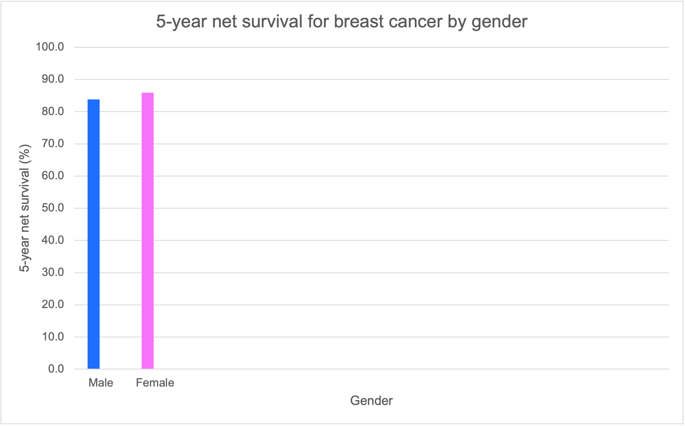

# 🩺 Breast Cancer Survival by Gender (NHS England Data)

## 📊 Project Overview  
This project explores gender disparities in **5-year net survival** for breast cancer using NHS England statistics (2016–2020). The goal was to build foundational skills in health data science by focusing on data cleaning, visualization, and interpretation.

---

## 💬 Key Insight  
- **Female 5-year net survival:** 85.9%  
- **Male 5-year net survival:** 83.8%

While the difference is small, it may reflect:  
- Later diagnosis in males  
- Lower awareness  
- Smaller sample size  

This highlights the importance of awareness campaigns targeted at men and tailored screening strategies.

---

## 📈 Survival Chart  
  
*Figure 1: 5-Year Net Survival for Breast Cancer by Gender*

---

## 📁 Files Included  
- `breast_cancer_chart.png`: Chart image  
- `breast_cancer_survival_data.xlsx`: Cleaned dataset and Excel chart  
- `BreastCancer_Survival_Portfolio.pdf`: Full project write-up  

---

## 📂 Data Source  
- National Cancer Survival Statistics, NHS England  
- Years analysed: 2016–2020  
- Focused metric: 5-year net survival, age-standardised  
- [NHS Cancer Data Website](https://www.cancerdata.nhs.uk/)

---

## 🚀 Skills Used  
- Data filtering & cleaning (Excel)  
- Descriptive analysis  
- Basic charting (Clustered Bar Chart)  
- Interpretation of health outcomes  
- Storytelling with data
•	Storytelling with data

## 📎 Author

**Casey Charles**  
Aspiring health data analyst | Biomedical Science BSc  
